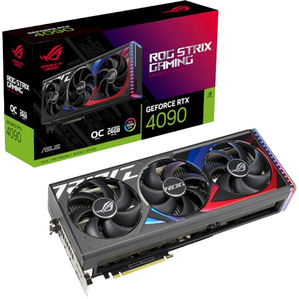

<html lang="uk">
<head>
  <meta charset="UTF-8"/>
  <meta name="viewport" content="width=device-width, initial-scale=1.0" />
  <title>GPU Store - Магазин відеокарт</title>
  
</head>
<body>
  <header>
    <nav>
      
🎮 GPU Store

      <ul class="nav-menu">
        <li><a href="#home">Головна</a></li>
        <li><a href="#products">Товари</a></li>
        <li><a href="#contact">Контакти</a></li>
        <li><button class="theme-toggle" id="themeToggle">🌙</button></li>
        <li class="cart-icon" onclick="toggleCart()">🛒0</li>
      </ul>
    </nav>
  </header>
  
  <section class="hero" id="home">
    <h1>Найкращі відеокарти за найкращими цінами</h1>
    
Вибери свою ідеальну GPU прямо зараз

  </section>
  
  

    <button class="active" onclick="filterProducts('all')">Всі</button>
    <button onclick="filterProducts('nvidia')">NVIDIA</button>
    <button onclick="filterProducts('amd')">AMD</button>
    <button onclick="filterProducts('intel')">Intel</button>
  

  
  <section class="products" id="products">
    <h2 class="section-title">Наші товари</h2>
    

      <!-- NVIDIA RTX 4090 -->
      

        
        
NVIDIA RTX 4090

        
65 000 ₴

        <button class="buy-btn" onclick="event.stopPropagation(); addToCart('NVIDIA RTX 4090', 65000)">Купити</button>
      

      
      <!-- NVIDIA RTX 4080 -->
      

        
        
NVIDIA RTX 4080

        
45 000 ₴

        <button class="buy-btn" onclick="event.stopPropagation(); addToCart('NVIDIA RTX 4080', 45000)">Купити</button>
      

      
      <!-- AMD RX 7900 XTX -->
      

        
        
AMD RX 7900 XTX

        
42 000 ₴

        <button class="buy-btn" onclick="event.stopPropagation(); addToCart('AMD RX 7900 XTX', 42000)">Купити</button>
      

      
      <!-- Intel ARC A770 -->
      

        
        
Intel ARC A770

        
25 000 ₴

        <button class="buy-btn" onclick="event.stopPropagation(); addToCart('Intel ARC A770', 25000)">Купити</button>
      

    

  </section>
  
  <footer id="contact">
  

    
📞 +380 (XX) XXX-XX-XX

    
📧 info@gpustore.ua

    
📍 м. Київ, вул. Технологічна, 1

    
&copy; 2025 GPU Store. Усі права захищені.

    
Маскот:

  

  

    
  

</footer>

  
  <!-- Кошик -->
  

    

      &times;
      <h2>Кошик</h2>
      
Кошик порожній

      
Загальна сума: 0 ₴

      <button class="buy-btn" onclick="checkout()">Оформити замовлення</button>
    

  

  
  <!-- Модальні вікна товарів -->
  

    

      &times;
      

        

          
        

        

          <h2>NVIDIA RTX 4090</h2>
          
<strong>Найпотужніша відеокарта для геймінгу та роботи з 3D.</strong>

          
<strong>Графічний чип:</strong> GeForce RTX 4090

          
<strong>Обсяг пам'яті:</strong> 24 ГБ

          
<strong>Система охолодження:</strong> активна

          
<strong>Максимальна роздільна здатність:</strong> 7680x4320

          
<strong>Тип пам'яті:</strong> GDDR6X

          
<strong>Розміри:</strong> 357,6 x 149,3 x 70,1 мм

          
<strong>Додаткове живлення:</strong> 16 pin

          <h3>65 000 ₴</h3>
          <button class="buy-btn" onclick="addToCart('NVIDIA RTX 4090', 65000); closeProductModal('modal4090')">Купити</button>
        

      

    

  

  
  

    

      &times;
      

        

          
        

        

          <h2>NVIDIA RTX 4080</h2>
          
<strong>Потужна відеокарта для 4K ігор.</strong>

          
<strong>Графічний чип:</strong> GeForce RTX 4080

          
<strong>Обсяг пам'яті:</strong> 16 ГБ

          
<strong>Система охолодження:</strong> активна

          
<strong>Тип пам'яті:</strong> GDDR6X

          
<strong>Рекомендовано для:</strong> 1440p/4K Gaming

          <h3>45 000 ₴</h3>
          <button class="buy-btn" onclick="addToCart('NVIDIA RTX 4080', 45000); closeProductModal('modal4080')">Купити</button>
        

      

    

  

  
  

    

      &times;
      

        

          
        

        

          <h2>AMD RX 7900 XTX</h2>
          
<strong>Флагманська відеокарта від AMD.</strong>

          
<strong>Графічний чип:</strong> AMD Radeon RX 7900 XTX

          
<strong>Обсяг пам'яті:</strong> 24 ГБ

          
<strong>Архітектура:</strong> RDNA 3

          
<strong>Тип пам'яті:</strong> GDDR6

          
<strong>Рекомендовано для:</strong> 4K Gaming, Ray Tracing

          <h3>42 000 ₴</h3>
          <button class="buy-btn" onclick="addToCart('AMD RX 7900 XTX', 42000); closeProductModal('modal7900')">Купити</button>
        

      

    

  

  
  

    

      &times;
      

        

          
        

        

          <h2>Intel ARC A770</h2>
          
<strong>Перша потужна відеокарта від Intel для геймінгу.</strong>

          
<strong>Графічний чип:</strong> Intel Arc A770

          
<strong>Обсяг пам'яті:</strong> 16 ГБ

          
<strong>Архітектура:</strong> Xe HPG

          
<strong>Тип пам'яті:</strong> GDDR6

          
<strong>Рекомендовано для:</strong> 1080p/1440p Gaming, Ray Tracing

          <h3>25 000 ₴</h3>
          <button class="buy-btn" onclick="addToCart('Intel ARC A770', 25000); closeProductModal('modalArc')">Купити</button>
        

      

    

  

  
</body>
</html>
